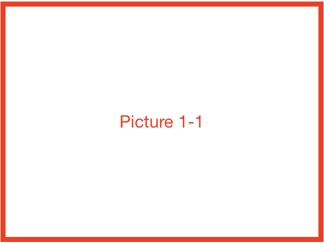

# Chapter 1 - Section 1

## Part 1

This is a test.The installation of embedXcode includes 3 basic steps and an optional one:

+ Step 1 :fontawesome-solid-link:

+ Step 2 :fontawesome-solid-external-link-alt:

